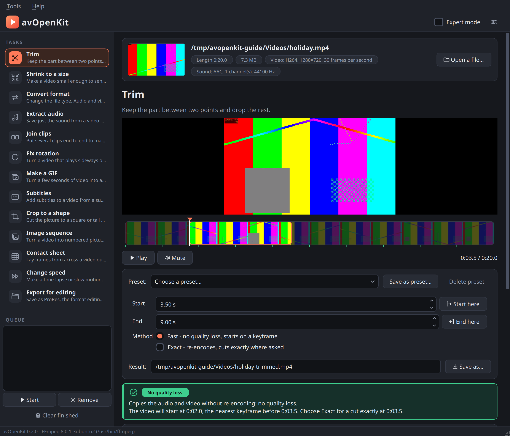
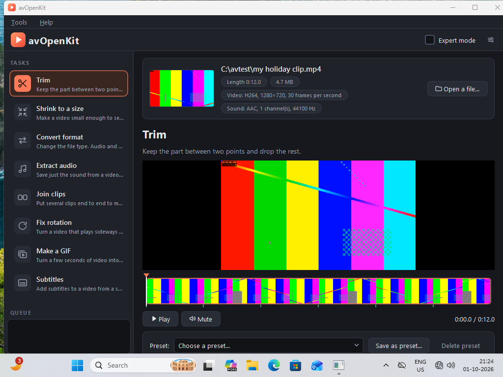
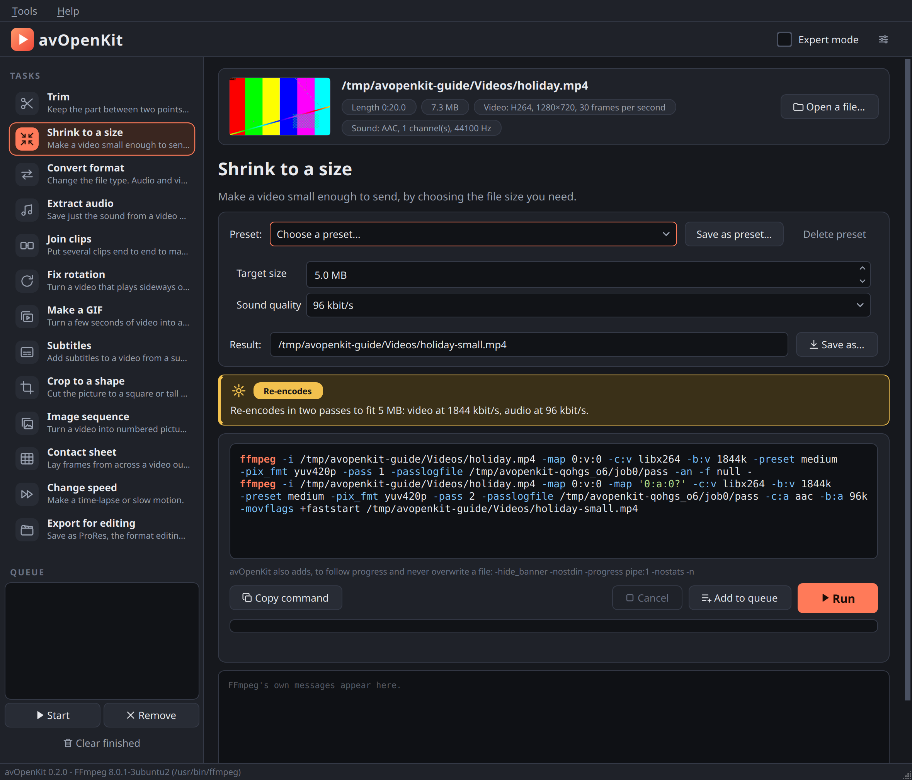
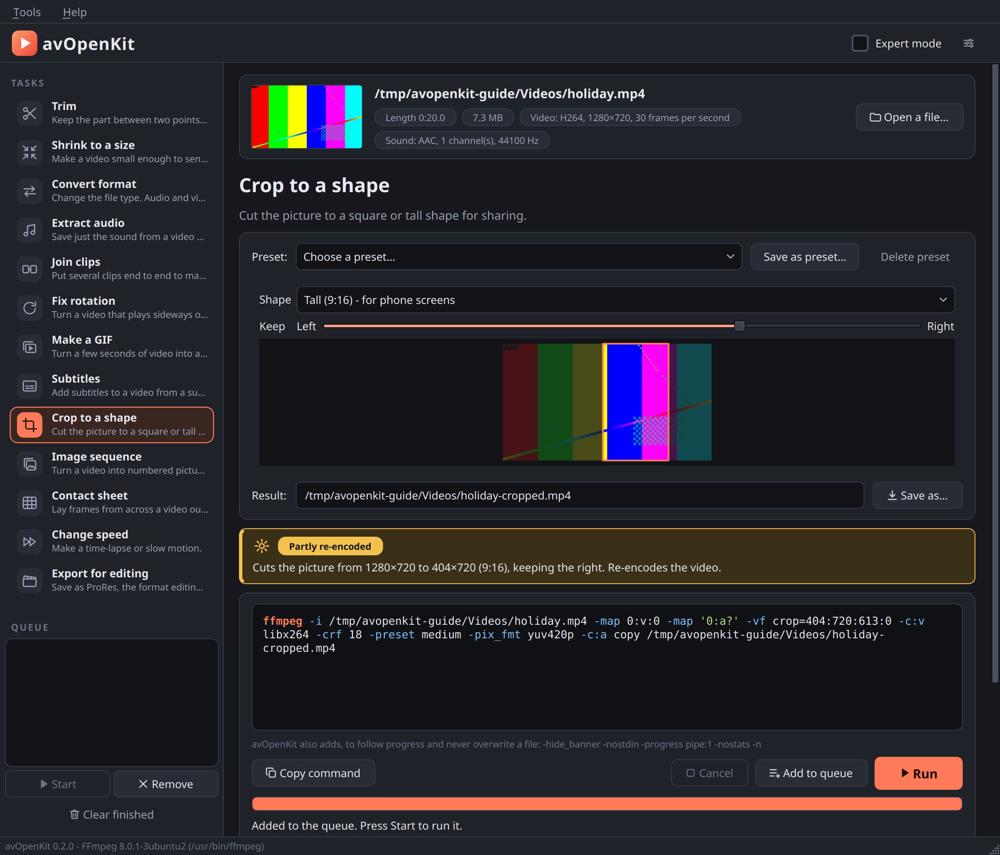
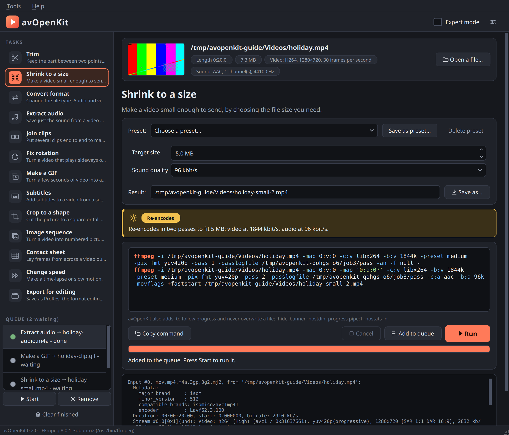
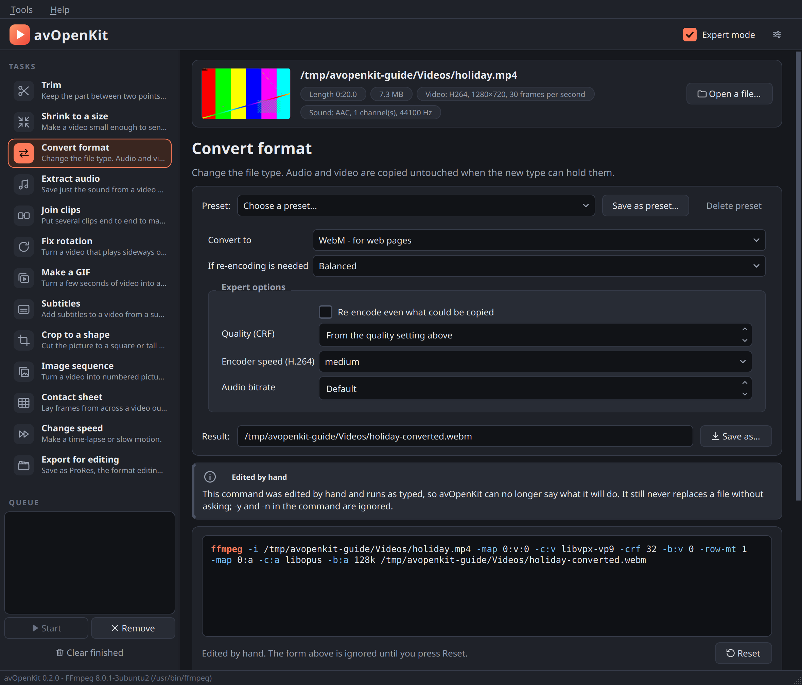
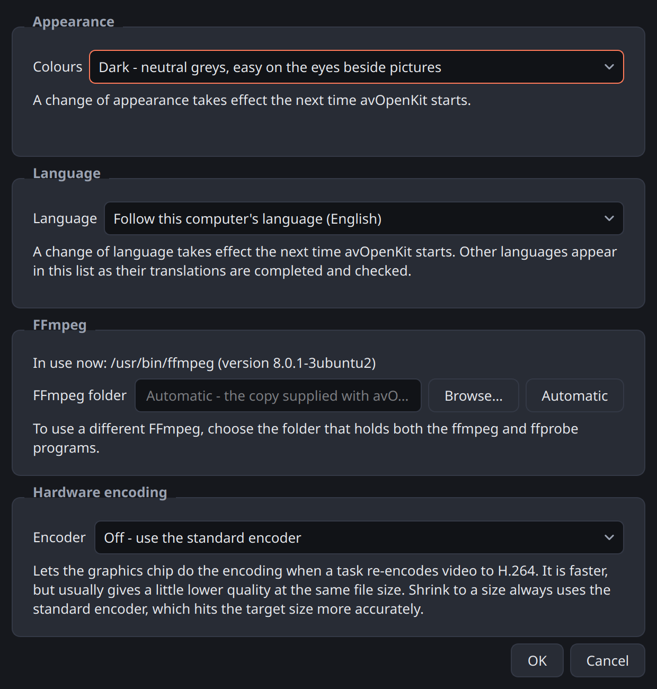
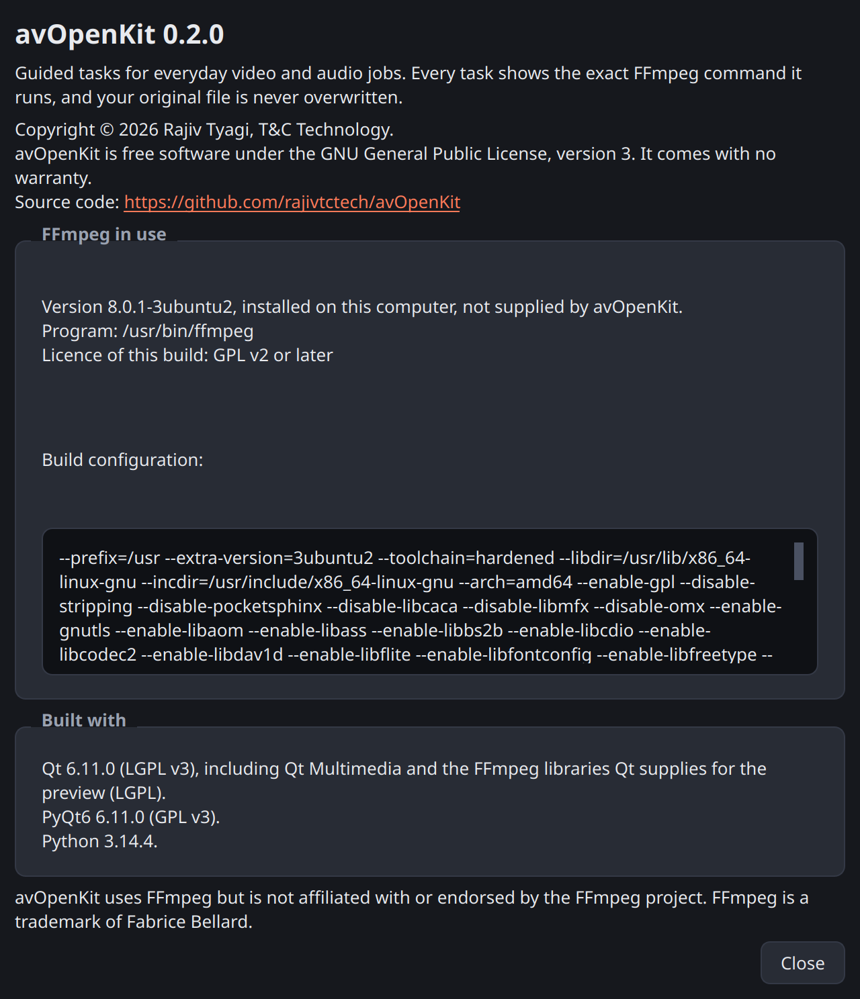

# About this guide

avOpenKit does small, everyday jobs on video and audio files: cutting a piece out, making a
video small enough to send, changing the file type, pulling out the sound, joining clips, turning
a sideways video upright, making a GIF, and adding subtitles. For people who make pictures it
also crops a video to a shape for sharing, turns a video into numbered pictures and back, lays
frames out as a contact sheet, makes time-lapses and slow motion, and exports for an editor.

**You do not need to read all of this guide.** Start with the part written for you and come back
to the others when you need them.

| Part | Written for | You will learn |
|---|---|---|
| **Part 1 — Getting started** | everyone | what the program is, why your files are safe, how to install and start it, what each area of the window is for |
| **Part 2 — Your first job** | beginners | trimming a video, step by step, from opening the file to playing the result |
| **Part 3 — The tasks** | everyone | what each task does, what each question means, and what to expect |
| **Part 4 — Working faster** | regular users | the preview, the queue, presets, and reading the command |
| **Part 5 — Expert mode and settings** | experienced users | codec-level options, editing the command, hardware encoding, choosing the FFmpeg to use |
| **Part 6 — Problems and diagnostics** | anyone stuck | what each message means, common puzzles, what to send with a bug report |
| **Part 7 — Expert reference** | engineers | every command each task generates, all defaults and limits, how the program is built |
| **Appendix** | everyone | a one-page quick reference, and a glossary |

**How this guide is written.** Everything here describes version 0.2.0 as it actually behaves.
The commands in Part 7 are produced by the program itself each time the guide is built, so they
cannot drift from what the program does. Where something has not been tested, or does not exist
yet, the guide says so plainly; the list is in section 7.8.

**Words in bold in quotation marks**, such as **"Run"**, are the exact words on a button or label.

# Part 1 — Getting started

## 1.1 What avOpenKit is

Almost every video tool in the world, including many websites and phone apps, does its real work
with a free program called **FFmpeg**. FFmpeg can do nearly anything to a video or audio file,
but it has no window and no buttons: you type a long command, and one wrong character gives an
error or, worse, a bad result. Most people use it by copying commands from the internet without
knowing what they mean.

avOpenKit puts a simple window in front of FFmpeg. You open a file, pick a task, answer a few
plain questions, and press **"Run"**. Before anything happens, avOpenKit shows you two things:

- **what will happen**, in ordinary words — for example, "Copies the audio and video without
  re-encoding: no quality loss";
- **the exact FFmpeg command** it is about to run. Rest the mouse on any part of the command and
  a note explains what that part does.

So you can use it without knowing anything about FFmpeg, and you can also use it to *learn*
FFmpeg, one command at a time.

## 1.2 What avOpenKit is not

It is **not a video editor**. There is no timeline, no transitions, no titles, no effects, and
no project file to save. If you need those, use an editor such as Shotcut, Kdenlive or OpenShot.
avOpenKit is for the jobs that are too small to be worth opening an editor for.

It also does not download videos from websites, does not handle copy-protected (DRM) files, and
does not record your screen.

## 1.3 Your files are safe

These rules are built into the program and are checked by its automatic tests.

| Promise | What it means |
|---|---|
| **Your original is never changed.** | Every task writes a *new* file. The file you opened is only read. |
| **The result can never be one of the inputs.** | If you type the original's own name as the result, the program refuses. |
| **Nothing is replaced without asking.** | If a file with the result's name already exists, you are asked **"Replace it?"**. If you answer No, nothing is touched. |
| **A failed or cancelled job leaves no half-made file.** | The unfinished result is deleted. A file that was already there before the job started is never deleted. |
| **Nothing leaves your computer.** | The program does not use the internet, has no account, and sends no usage data. |
| **Only FFmpeg works on your files.** | The program runs `ffmpeg` and its companion `ffprobe`, and nothing else, on your files. Even a command you type yourself in expert mode is refused unless it is an FFmpeg command. |

> One thing to know: a re-encoded copy is never *identical* to the original, and each
> re-encoding loses a little quality. Keep your original file. avOpenKit always tells you, before
> you press **"Run"**, whether a job copies (no loss) or re-encodes.

## 1.4 What you need

| | Linux | Windows |
|---|---|---|
| System | 64-bit; Ubuntu 22.04 or newer, or another distribution of the same age or newer | Windows 10 or 11, 64-bit |
| FFmpeg | Version 6.0 or newer must be installed, with its companion `ffprobe`. On Ubuntu both come in the one package `ffmpeg`. | Included in the download. Nothing to install. |
| Disk space | About 90 MB | About 340 MB once unpacked |

**Ubuntu 22.04 users:** the FFmpeg that Ubuntu 22.04 supplies is version 4.4, which is too old.
Install a newer FFmpeg separately and point avOpenKit to it in Settings (section 5.4). Ubuntu
24.04 and newer supply a suitable one.

## 1.5 Installing

The downloads are on the releases page:
<https://github.com/rajivtctech/avOpenKit/releases>

### On Linux

1. Install FFmpeg if it is not already there. Open a terminal and type:

   ```
   sudo apt install ffmpeg
   ```

2. Download the file `avOpenKit-linux-x86_64` from the releases page.
3. Allow it to be run. In a terminal, in the folder you downloaded it to:

   ```
   chmod +x avOpenKit-linux-x86_64
   ```

   (Or, in your file manager: right-click the file, choose Properties, then Permissions, and
   tick the box that allows it to be run as a program.)

That one file is the whole program. Keep it wherever you like.

### On Windows

1. Download `avOpenKit-windows-x64.zip` from the releases page.
2. Right-click the downloaded file and choose **Extract All…**. Extract it to a folder of your
   choice — your Documents folder, for instance. Do not try to run the program from inside the
   zip file; it has to be extracted first.
3. In the extracted `avOpenKit` folder, double-click `avOpenKit.exe`.

Keep the whole folder together: the program needs the `_internal` folder beside it, which also
holds the FFmpeg it uses.

> **Windows may show a warning** the first time: "Windows protected your PC". This appears
> because the program does not carry a publisher's certificate. Choose **More info**, then
> **Run anyway**.

### From the source code

Developers can run avOpenKit straight from its source. This needs Python 3.10 or newer and git:

```
git clone https://github.com/rajivtctech/avOpenKit.git
cd avOpenKit
python3 -m venv .venv
.venv/bin/pip install -e .
.venv/bin/python -m avopenkit
```

## 1.6 Starting the program

**Linux:** double-click `avOpenKit-linux-x86_64` in your file manager, or in a terminal type
`./avOpenKit-linux-x86_64`. To start it with a file already open, put the file's name after it:

```
./avOpenKit-linux-x86_64 ~/Videos/holiday.mp4
```

**Windows:** double-click `avOpenKit.exe`. You can also drag a video file onto `avOpenKit.exe`
to start the program with that file open.

**If FFmpeg is missing** (Linux), the program shows a message that says so and gives the command
to install it, then closes. Install FFmpeg and start again.

**If FFmpeg is there but cannot be started**, the program says where it found it and closes.
Check that typing `ffmpeg -version` in a terminal works.

**If FFmpeg is older than version 6.0**, the program warns you and still opens. Most tasks will
work; **"Fix rotation"** needs version 6.0.

## 1.7 The window





| Area | Where | What it is for |
|---|---|---|
| **Menus** | top | **"Tools" → "Settings…"** and **"Help" → "About avOpenKit"** |
| **"Expert mode"** | top right | Shows extra options and lets you edit the command (Part 5). The small button beside it opens Settings. |
| **Task list** | left | The thirteen tasks, each with its picture and a line saying what it does. Click one to choose it. |
| **Queue** | bottom left | Jobs waiting, running and finished (Part 4). |
| **The file** | top of the right-hand side | A picture from the file, its name, and its facts as small labels: length, size, and what video and sound it contains. **"Open a file…"** opens another. You can also drag a file from your file manager and drop it anywhere on the window. |
| **Preview and filmstrip** | below the task's name | For **"Trim"** and **"Make a GIF"** only: the video, a strip of frames from the whole file, **"Play"** and **"Mute"**. |
| **"Preset:"** | above the questions | Saved sets of answers (Part 4). |
| **The questions** | middle | Different for each task. |
| **"Result:"** | below the questions | The name the new file will have. avOpenKit suggests one; type over it or press **"Save as…"** to choose your own. |
| **The note box** | coloured box below the questions | In plain words, what the job will do. Read this before pressing **"Run"**. Its colour tells you the most important thing at a glance (see below). |
| **The command** | box with typewriter letters | The exact FFmpeg command, in colour. |
| **"Copy command"**, **"Cancel"**, **"Add to queue"**, **"Run"** | below the command | |
| **Progress bar and result line** | below the buttons | How far the job is, and afterwards how it ended. |
| **FFmpeg's messages** | bottom | Everything FFmpeg itself printed. Useful when a job fails. Scroll down to reach it. |
| **Status bar** | very bottom | The avOpenKit version and which FFmpeg is in use. |

**The colour of the note box** says whether your picture and sound keep their quality:

| Colour and label | Meaning |
|---|---|
| Green, **"No quality loss"** | Everything is copied exactly as it is. |
| Amber, **"Re-encodes"** | The video or sound is compressed again: slower, with a small loss of quality. |
| Amber, **"Partly re-encoded"** | One of them is copied and the other compressed again. |
| Red, **"Cannot run yet"** | Something has to be put right first; the box says what. |

**Every option has a short explanation.** Rest the mouse on any box, button or choice for a
moment and a note appears.

# Part 2 — Your first job

This part walks through one complete job: cutting the middle out of a video. Every other task
follows the same pattern, so once you have done this you know how the program works.

## 2.1 Open the video

Press **"Open a file…"** and choose your video, or drag it from your file manager onto the
window.

A picture from the file and its name appear at the top. Beside them, small labels tell you about
the file, for example:

> Length 0:20.0 · 7.3 MB · Video: H264, 1280×720, 30 frames per second · Sound: AAC, 1 channel(s), 44100 Hz

If the file cannot be read as video or audio, a message says so and nothing else changes.

## 2.2 Choose the task

**"Trim"** is the first task in the list and is already chosen. A line in bold says what the task
does: *Keep the part between two points and drop the rest.*

## 2.3 Choose the start and the end

Under the picture is a **filmstrip**: a row of frames taken from the whole video, so you can see
at a glance where each scene is. Click on the filmstrip, or drag along it, until the picture
shows the moment where you want your clip to **begin**. Press **"Start here"**. The **"Start"**
box now shows that time in seconds.

Move to where you want the clip to **end**, and press **"End here"**.

The part you have chosen stays bright on the filmstrip and the rest is dimmed, so you can see
what you are keeping. The small green ticks under the filmstrip are the keyframes (see the next
step).

You can also type the times straight into the **"Start"** and **"End"** boxes. When you type a
time, the picture jumps to that moment so you can see where the cut will be.

To move in small steps, click on the filmstrip and then use the keyboard: the arrow keys move a
tenth of a second, and Page Up and Page Down move one second.

## 2.4 Read what will happen

Look at the note box. For a trim it is normally green, labelled **"No quality loss"**, and says
two things:

> Copies the audio and video without re-encoding: no quality loss.
>
> The video will start at 0:02.0, the nearest keyframe before 0:03.5. Choose Exact for a cut
> exactly at 0:03.5.

The second line matters. A fast trim copies the video exactly as it is, which is instant and
loses nothing, but a video can only be cut cleanly at certain frames called **keyframes**
(explained in the glossary). So the result may begin a little *earlier* than the point you
chose — here, 1.5 seconds earlier. avOpenKit tells you the real starting point before you run the
job, so there are no surprises. The green ticks under the filmstrip show where the keyframes
are: put your start on a tick and a fast trim begins exactly there.

If you need the cut exactly where you put it, choose **"Exact - re-encodes, cuts exactly where
asked"**. It is slower and re-encodes the video, with a very small loss of quality.

## 2.5 Check the result's name

The **"Result:"** box shows the name of the new file. avOpenKit suggests the original's name
with `-trimmed` added, in the same folder as the original: `holiday.mp4` becomes
`holiday-trimmed.mp4`. If that name is taken, it suggests `holiday-trimmed-2.mp4`, and so on.

## 2.6 Run it

Press **"Run"**. The progress bar fills. A fast trim usually takes a second or two.

When it finishes, the result line says, for example:

> Done: holiday-trimmed.mp4 (2.5 MB) - the original is 7.3 MB

Two buttons appear: **"Play result"** opens the new file in your usual video player, and
**"Open folder"** shows it in your file manager.

Your original file is exactly as it was.

## 2.7 If something goes wrong

If the job fails, the result line begins with **"Failed."** and, where avOpenKit recognises the
cause, a plain explanation. FFmpeg's own messages are in the box at the bottom. Part 6 lists the
messages and what to do.

To stop a job that is running, press **"Cancel"**. The unfinished file is deleted.

# Part 3 — The tasks

Every task works the same way: open a file, choose the task, answer the questions, read what
will happen, press **"Run"**. This part describes each task's questions and what to expect.

The suggested name for the result is given for each task. You can always change it.

## 3.1 Trim

*Keep the part between two points and drop the rest.* Result: `name-trimmed`, same file type.

| Question | Meaning |
|---|---|
| **"Start"**, **"End"** | The part to keep, in seconds from the beginning. Use **"Start here"** and **"End here"** to take the time from the preview. |
| **"Fast - no quality loss, starts on a keyframe"** | Copies the video and sound untouched. Instant. The result may begin a little before the start you chose; the note box says exactly where. |
| **"Exact - re-encodes, cuts exactly where asked"** | Re-encodes the video so it can be cut at any frame. Slower; very small loss of quality. |

**Which to choose.** Use Fast unless the exact starting frame matters. If the note box says the
video will start at the time you asked for, Fast and Exact give the same cut and Fast is better.

**Sound-only files** (MP3 and the like) are always trimmed by copying, and the cut is close to
exact because sound has no keyframes to wait for.

**File type with Exact.** An exact trim produces H.264 video. If the original is a type that
cannot hold H.264 (WebM, for example), the result is suggested as an MP4.

## 3.2 Shrink to a size

*Make a video small enough to send, by choosing the file size you need.* Result:
`name-small.mp4`.



| Question | Meaning |
|---|---|
| **"Target size"** | The largest size the result may be, in megabytes. |
| **"Sound quality"** | How much of that size is spent on sound: 64, 96, 128 or 192 kbit/s. 96 suits speech and most video; choose more for music. |

The **"Preset:"** box offers four ready-made sizes: 10 MB, 25 MB, 50 MB and 100 MB.

**What it does.** avOpenKit works out the video quality that will fit your size, and encodes the
video twice ("two passes"): the first pass studies the video, the second uses what it learned to
spend the available size where the picture needs it most. This takes about twice as long as a
single encode, and lands close to the target.

**What to expect.**

- The result comes out a little *under* the target, never over. In testing, a 2000 kB target gave
  a 1930 kB file.
- "MB" here means one million bytes, the smaller of the two meanings in use, so the result stays
  under the limit whichever way the receiving service counts.
- If the size leaves too little for a clear picture at the original size, the picture is made
  smaller, and the note box says so: *Picture reduced from 720p to 360p so it stays clear at
  this size.* A small sharp picture looks better than a large blurry one.
- If the file is already smaller than your target, the note box warns you that re-encoding will
  not help.
- If the target is impossibly small for the video's length, the program refuses and suggests a
  larger size or trimming the video first.

## 3.3 Convert format

*Change the file type. Audio and video are copied untouched when the new type can hold them.*
Result: `name-converted` with the new ending.

| Choice under **"Convert to"** | Use it when |
|---|---|
| **"MP4 - plays almost everywhere"** | You are not sure. Phones, televisions, websites and editing programs all take MP4. |
| **"WebM - for web pages"** | A website asks for WebM. Slow to make. |
| **"MKV - keeps everything, including subtitles"** | You want to change the container without losing anything. |
| **"MOV - for Apple software"** | An Apple program asks for MOV. |

**"If re-encoding is needed"** — **"High quality, larger file"**, **"Balanced"**, or **"Smaller
file, lower quality"**. This is used *only* if the video or sound cannot simply be copied into
the new file type.

**What it does.** A video file is a container (the file type) holding video and sound that are
each stored in some format. Often the video and sound inside are fine and only the container
needs to change; then avOpenKit copies them across untouched, which is fast and loses nothing.
When the new container cannot hold the existing format, that part — and only that part — is
re-encoded. The note box tells you which, for example:

> Video (h264) is copied without re-encoding.
>
> Audio is re-encoded to AAC.

**Subtitles.** Only MKV keeps subtitle tracks. For the other types the note box warns:
*Subtitle tracks are not carried over to this format; choose MKV to keep them.*

## 3.4 Extract audio

*Save just the sound from a video as an audio file.* Result: `name-audio` with an audio ending.

| Choice under **"Save as"** | Meaning |
|---|---|
| **"Keep the original audio - no quality loss"** | Copies the sound exactly as it is in the video. The file type follows the sound's format: AAC becomes `.m4a`, MP3 becomes `.mp3`, and so on. |
| **"MP3 - plays everywhere"** | Converts to MP3. |
| **"M4A (AAC)"** | Converts to AAC. |
| **"Opus - smallest"** | Converts to Opus, the most efficient of these. |
| **"WAV - uncompressed, large"** | Converts to plain uncompressed sound, for programs that need it. |

Choose **"Keep the original audio"** unless the device or program you will play it on needs a
particular type. If the video has more than one sound track, the first is used.

## 3.5 Join clips

*Put several clips end to end to make one file.* Result: `name-joined`, where *name* is the
first clip.

This task has its own list of files. The file you opened is put in the list for you.

| Button | Does |
|---|---|
| **"Add clips…"** | Adds one or more files to the list. You can also drop files on the window while this task is chosen. |
| **"Remove"** | Takes the selected clip off the list. |
| **"Move up"**, **"Move down"** | Changes the order. The clips play from top to bottom. |

**What it does.** If all the clips match — same video format, picture size, frame rate, rotation,
and same sound format — they are joined without re-encoding, which is fast and loses nothing.
Clips from the same phone or camera usually match.

If they differ, the note box lists every difference, clip by clip, and the clips are re-encoded
to the picture size and frame rate of the **first** clip. Smaller or differently-shaped clips
are fitted inside that size with black borders rather than stretched.

**Sound.** If any clip has no sound and the clips have to be re-encoded, the result is silent,
and the note box says so.

## 3.6 Fix rotation

*Turn a video that plays sideways or upside down.* Result: `name-rotated`.

| Choice under **"Rotation"** | |
|---|---|
| **"Turn right (clockwise)"** | A quarter turn to the right. |
| **"Turn left (counter-clockwise)"** | A quarter turn to the left. |
| **"Turn upside down"** | A half turn. |
| **"Mirror left-right"**, **"Mirror top-bottom"** | Flips the picture. |

Choose the turn that would make the picture, *as you see it now*, come upright.

**"Bake in - re-encode so every player shows it turned"** — leave this off at first.

**What it does.** With **"Bake in"** off, avOpenKit changes only a small note inside the file
that says "show this picture turned". The picture itself is not touched, so the job is instant
and loses nothing. Phones do the same thing when they record sideways. If the file already has
such a note, the new turn is added to it.

Nearly all players obey the note. A few do not. If the result still looks wrong in the place
you need it, run the task again with **"Bake in"** on: the picture is then actually turned and
re-encoded, and every player will show it the same way.

Some file types (AVI, for example) cannot hold the note. For those avOpenKit bakes the turn in
automatically and says so.

## 3.7 Make a GIF

*Turn a few seconds of video into a looping GIF picture.* Result: `name-clip.gif`.

| Question | Meaning |
|---|---|
| **"Start"** | Where in the video the GIF begins. Use **"Start here"** to take it from the preview. |
| **"Length"** | How many seconds it shows. Starts at 3. |
| **"Width"** | Width in pixels; the height follows. Starts at 480. The GIF is never made wider than the video. |
| **"Frames per second"** | Starts at 12. Ten to fifteen looks smooth enough. |

**What to expect.** GIF is an old format: no sound, only 256 colours, and large files. To keep
the file small, keep it short, narrow, or both. Halving the width makes the file roughly a
quarter of the size. avOpenKit works out the best 256 colours for your particular clip, which
gives a much better picture than a fixed set of colours.

## 3.8 Subtitles

*Add subtitles to a video from a subtitle file.* Result: `name-subtitled`.

You need a subtitle file: a small text file holding the words and their timings, with a name
ending in `.srt`, `.ass`, `.ssa` or `.vtt`. Press **"Browse…"** to choose it.

| Choice under **"How"** | Meaning |
|---|---|
| **"Add as a track - can be switched on and off, no re-encoding"** | The subtitles are stored beside the video inside the file. The viewer switches them on in the player. Nothing is re-encoded, so it is instant and loses nothing. |
| **"Burn in - always visible, re-encodes the video"** | The words are drawn into the picture. They show everywhere and cannot be switched off. The video is re-encoded. |

**Which to choose.** Add as a track when the video will be watched in a proper player. Burn in
when it is going somewhere that ignores subtitle tracks — many messaging apps and social media
sites do.

A track can be added to MP4, MOV, MKV and WebM files. For other types the result is suggested as
an MKV.

## 3.9 Crop to a shape

*Cut the picture to a square or tall shape for sharing.* Result: `name-cropped`.



| Question | Meaning |
|---|---|
| **"Shape"** | **"Square (1:1)"**, **"Portrait (4:5)"** or **"Tall (9:16) - for phone screens"**. |
| **"Keep"** | A slider that chooses which part of the picture stays: from **"Left"** to **"Right"** when the sides are cut off, from **"Top"** to **"Bottom"** when the top and bottom are. |

A small picture of your video shows the result before you run anything: the part that will be
kept is bright and the rest is dimmed. Move the slider and watch it move.

**What it does.** The crop is the largest piece of that shape that fits inside the picture.
Nothing is stretched or shrunk, so the cropped video is as sharp as the original. The video is
re-encoded; the sound is copied untouched. If the picture is already the shape you chose, the
program says so.

A video that plays turned (filmed with the phone upright, for instance) is cropped as you see
it, not as it is stored.

## 3.10 Image sequence

*Turn a video into numbered pictures, or numbered pictures into a video.*

This task works in two directions, and chooses by itself from the file you have open.

**A video is open: it is saved as pictures.** Result: a new folder, `name-frames`, holding
`frame-00001.png`, `frame-00002.png`, and so on.

| Question | Meaning |
|---|---|
| **"Save as"** | **"PNG - exact, larger files"** keeps every pixel. **"JPEG - smaller files"** is much smaller and loses a little. |
| **"How many"** | **"Every frame"**, or 1, 2, 5 or 10 pictures per second of video. |

The note box tells you roughly how many pictures there will be. Every frame of even a short
video is a great many files — a one-minute video at 30 frames per second is 1800 pictures — so
choose fewer per second unless you need them all, or trim the video first.

The result is always a **new** folder. If a folder of that name exists, the program asks you to
choose another name rather than mix pictures into it.

**A picture is open: its series is made into a video.** Open the *first* picture of a numbered
series — `frame-0001.png`, with `frame-0002.png`, `frame-0003.png` and the rest beside it in
the same folder. Result: `name-video.mp4`.

| Question | Meaning |
|---|---|
| **"Pictures per second"** | How many of the pictures are shown each second. 24 is usual for film and animation; 12 gives a rougher, hand-made look. |

The note box says how many pictures it found, from which to which, and how long the video will
be. The series is counted from the picture you opened, upwards, and stops at the first missing
number.

Pictures with an odd width or height are trimmed by one pixel, because the video format needs
even numbers.

## 3.11 Contact sheet

*Lay frames from across a video out as one picture.* Result: `name-sheet.jpg`.

| Question | Meaning |
|---|---|
| **"Columns"**, **"Rows"** | How many frames across and down, from 1 to 12 each. Columns times rows is the number of frames. |
| **"Width of each frame"** | In pixels. The height follows. |
| **"Save as"** | **"JPEG - smaller file"** or **"PNG - exact"**. |

**What it does.** The frames are taken at even steps through the whole video, so the sheet
shows the video from start to end at a glance. The note box tells you how far apart the frames
are and how large the finished picture will be. It is quick even for a long film, because each
frame is fetched by jumping straight to its moment.

## 3.12 Change speed

*Make a time-lapse or slow motion.* Result: `name-fast` or `name-slow`.

| Question | Meaning |
|---|---|
| **"Speed"** | **"8 times faster - time-lapse"**, **"4 times faster"**, **"2 times faster"**, **"Half speed - slow motion"** or **"Quarter speed"**. |
| **"Keep the sound, at the new speed"** | The sound is sped up or slowed to match, and keeps its pitch — voices do not turn squeaky or deep. Untick it for a silent result, which is usual for a time-lapse. |

The note box tells you how long the result will be.

**About slow motion.** Slowing a video down cannot invent frames that were never filmed: each
frame is simply shown for longer. It looks smooth only if the video was filmed at a high frame
rate (60 or 120 frames per second). An ordinary 30-frames-per-second video at quarter speed
will look jerky.

## 3.13 Export for editing

*Save as ProRes, the format editing programs handle best.* Result: `name-prores.mov`.

| Choice under **"Quality"** | Use it when |
|---|---|
| **"ProRes 422 Proxy - smallest, for rough cuts"** | You need small working copies. |
| **"ProRes 422 LT"** | A lighter version of the usual choice. |
| **"ProRes 422 - the usual choice"** | You are not sure. |
| **"ProRes 422 HQ - highest quality, largest"** | The editor asks for HQ. |

**What it does.** The videos that phones and cameras make are compressed very tightly, which
makes them small but hard work for an editing program to move through. ProRes stores every
frame whole, so editing is smooth.

**Expect a very large file** — many times the size of the original. This task is for handing
work to an editor, not for sending or sharing. If in doubt, ask the editor which quality they
want.

# Part 4 — Working faster

## 4.1 The preview

**"Trim"** and **"Make a GIF"** show a preview, because for those you choose a moment in the
video.

| Control | Does |
|---|---|
| The filmstrip | Click or drag to move through the video. The bright part is what the task will use; the green ticks underneath are keyframes. The time is shown below it, on the right. |
| **"Play"** / **"Pause"** | Plays from where the slider is. |
| **"Mute"** | Silences the preview. It has no effect on the result. |
| Keyboard, after clicking the filmstrip | Arrow keys: a tenth of a second. Page Up / Page Down: one second. |

**The preview does not decide the result.** It is only for looking. The times that go into the
job are the numbers in the **"Start"** and **"End"** boxes.

**Still pictures instead of video.** Some files the built-in player cannot play. When that
happens the preview switches by itself to still pictures taken by FFmpeg, and a note explains:
*Showing still pictures without sound … This does not affect the result.* You can still use the
filmstrip and **"Start here"** and **"End here"**; only **"Play"** is unavailable.

## 4.2 Reading the command

The box with typewriter letters shows exactly what FFmpeg will be asked to do. It is coloured so
that its structure can be seen: the program name, the options (the words beginning with a
dash), and file names that contain spaces.

- **Rest the mouse on any word** to see what it means. An option and its value share one
  explanation, so pointing at `-crf` or at the `23` after it shows the same note.
- **"Copy command"** puts the command on the clipboard, so you can paste it into a terminal, a
  script or a message.
- **The line under the box** lists a few things avOpenKit adds to every command for its own use:
  `-hide_banner -nostdin -progress pipe:1 -nostats -n`. Rest the mouse on that line to see what
  each is for. The important one is `-n`: never replace an existing file.

A task that needs two runs of FFmpeg (**"Shrink to a size"**) shows two lines.

**Using a copied command in a terminal.** The command works as it stands. If you run it
yourself, FFmpeg will ask before replacing an existing file.

## 4.3 The queue

Some jobs take a long time. The queue lets you line up several and get on with something else.



| Button | Does |
|---|---|
| **"Run"** | Adds this job to the queue and starts the queue. If jobs are already waiting, they run first. |
| **"Add to queue"** | Adds this job without starting anything. |
| **"Start"** (under the queue) | Runs the waiting jobs one after another. |
| **"Cancel"** | Stops the job that is running and deletes its unfinished file. Jobs still waiting stay in the queue; press **"Start"** to carry on. |
| **"Remove"** | Takes the selected job off the list. A running job cannot be removed; cancel it first. |
| **"Clear finished"** | Removes the jobs that are done, failed or cancelled. |

**While a job runs, the rest of the window stays usable.** Choose another task or open another
file, set it up, and press **"Run"** or **"Add to queue"**; it takes its place in the line.

**Each job in the list shows its state** — waiting, running, done, failed or cancelled — in words
and as a coloured dot: grey for waiting, orange for running, green for done, red for failed. Click a
job to see its progress or outcome, FFmpeg's messages for it, and, if it finished, the
**"Play result"** and **"Open folder"** buttons.

**Good to know.**

- A failed job does not stop the queue; the next one starts.
- Two jobs can never write the same result file. Suggested names skip names already taken by a
  waiting job, and if you type a name that is taken, the program says so.
- If a result's name already exists on disk, you are asked whether to replace it **when you add
  the job**, not later when it runs.
- **The queue is not saved.** Closing the program discards jobs that have not run.

## 4.4 Presets

A preset is a saved set of answers for one task, under a name of your choice.

| To | Do this |
|---|---|
| Save one | Set the questions the way you want, press **"Save as preset…"**, and type a name. |
| Use one | Pick it from the **"Preset:"** box. The questions change to match. |
| Change one | Use it, alter the answers, press **"Save as preset…"** and give the same name. You are asked before it is replaced. |
| Delete one | Pick it in the **"Preset:"** box, then press **"Delete preset"**. |

**Good to know.**

- Presets belong to their task. A preset saved for **"Make a GIF"** appears only there.
- **A preset stores the answers, not the file.** Start and end times, the subtitle file, the list
  of clips to join and the result's name are *not* saved, because they belong to one particular
  video.
- Presets are remembered between runs of the program.
- The four size presets that come with **"Shrink to a size"** are ordinary presets: you can
  change or delete them.
- If you change any answer after choosing a preset, the **"Preset:"** box goes back to
  **"Choose a preset…"**, to show that the form no longer matches it.

# Part 5 — Expert mode and settings

## 5.1 Expert mode

Tick **"Expert mode"** at the top right. Two things change, and the program remembers your
choice for next time.

1. Every task shows a group called **"Expert options"**.
2. The command box becomes editable.

In simple mode the expert options are hidden *and not used*: a value left in a hidden box cannot
affect the result. Switching to expert mode without touching anything changes no command.



## 5.2 The expert options

| Task | Option | Meaning | Starts at |
|---|---|---|---|
| Trim | **"Quality (CRF), exact trim"** | Lower is better quality and a larger file | 18 |
| | **"Encoder speed, exact trim"** | Slower makes a smaller file at the same quality | medium |
| | **"Audio bitrate, exact trim"** | | 192 kbit/s |
| Shrink | **"Encoder speed"** | | medium |
| | **"Picture height"** | Automatic, keep the original size, or a fixed height from 1080p to 240p | Automatic |
| Convert | **"Re-encode even what could be copied"** | For example, to make the file smaller | off |
| | **"Quality (CRF)"** | Overrides the quality choice above it | from the quality choice |
| | **"Encoder speed (H.264)"** | | medium |
| | **"Audio bitrate"** | | Default |
| Extract audio | **"Bitrate (MP3, M4A, Opus)"** | Not used for WAV | Default |
| Join | **"Re-encode even when the clips match"** | Try this if a joined file stutters or loses sound at the joins | off |
| | **"Quality (CRF), when re-encoding"** | | 20 |
| | **"Encoder speed, when re-encoding"** | | medium |
| Fix rotation | **"Quality (CRF), when baking in"** | | 18 |
| | **"Encoder speed, when baking in"** | | medium |
| Make a GIF | **"Repeat for ever"** | Untick for a GIF that plays once | on |
| | **"Dithering"** | How the 256 colours are mixed to imitate the rest | Sierra |
| Crop to a shape | **"Quality (CRF)"**, **"Encoder speed"** | | 18, medium |
| Image sequence | **"JPEG quality, video to pictures"** | 2 is the best; larger numbers make smaller, rougher pictures | 2 |
| | **"Quality (CRF), pictures to video"**, **"Encoder speed, pictures to video"** | | 18, medium |
| Contact sheet | **"Gap"** | The black space between frames and around the edge | 6 px |
| Change speed | **"Exact speed"** | Any speed from 0.1 to 100 times, instead of the list | from the list |
| | **"Quality (CRF)"**, **"Encoder speed"** | | 18, medium |
| Export for editing | **"Sound"** | 16 or 24 bits | 16 bits |
| Subtitles | **"Language of the track"** | A two- or three-letter code such as `hin`, `eng`, `spa`, so players list the track by language | empty |
| | **"Quality (CRF), when burning in"** | | 20 |
| | **"Encoder speed, when burning in"** | | medium |

**About CRF.** The quality number runs from 0 to 51 for H.264 (0 to 63 for WebM). Lower is
better and larger. 18 is close to lossless to the eye; 23 is FFmpeg's usual default; 28 is
visibly compressed. A value out of range is refused with a plain message.

**Presets and expert options.** A preset saved in expert mode includes the expert options. Used
in simple mode, its ordinary answers apply and the program tells you that its expert options are
used only when expert mode is on.

## 5.3 Editing the command

In expert mode you can click in the command box and change the command.

As soon as you do, a line appears: **"Edited by hand. The form above is ignored until you press
Reset."** The note box says that the command now runs as typed and that avOpenKit can no longer
say what it will do. **"Reset"** throws the edit away and shows the form's command again.

Four rules still apply to a command you have edited:

| Rule | Why |
|---|---|
| Every line must start with `ffmpeg`. | No other program is ever run. |
| The command is not passed through a shell. | Characters such as `;` `>` `$HOME` have no special effect: they are handed to FFmpeg as ordinary words, so they cannot start another program or redirect anything. |
| `-y` and `-n` are ignored. | Whether to replace a file stays a question the window asks you. |
| The result may not be one of the command's own inputs. | Your original stays safe. |

If the command cannot be run — an unclosed quotation mark, a line that does not start with
`ffmpeg` — **"Run"** is disabled and the note box says why.

**Good to know.**

- avOpenKit takes the *last word* of the command as the result file. If you add a second result
  file, the program does not know about it; FFmpeg will still refuse to replace an existing
  file, and that is reported as a failure.
- The hover explanations work on your edited command too. An option avOpenKit has no explanation
  for is said to be unknown, with a pointer to FFmpeg's documentation.
- Choosing another task, opening another file, or leaving expert mode discards the edit.

## 5.4 Settings

**"Tools" → "Settings…"**



### Appearance

**"Dark"** (the usual choice) uses neutral dark greys, as picture and video programs do, so that
the interface does not compete with your images. **"Light"** is there for bright rooms and for
those who prefer it. A change takes effect the next time the program starts.

### Language

Choose a language, or **"Follow this computer's language"**. A change takes effect the next
time the program starts.

**At present only English is available.** The program is prepared for eleven languages —
English, Hindi, Spanish, French, Bengali, Punjabi, Odia, Tamil, Telugu, Kannada and
Malayalam — and each will appear in this list once its translation has been completed and
checked by a fluent speaker. FFmpeg commands, FFmpeg's own messages and technical names are
never translated, because they are what you would type or search for.

### FFmpeg

**"In use now"** shows which FFmpeg the program is using. Normally you leave the box below it
empty, and avOpenKit uses the FFmpeg installed on your computer.

To use a different FFmpeg — a newer build you downloaded, for instance — press **"Browse…"** and
choose the folder that holds both `ffmpeg` and `ffprobe`. When you press OK the choice is
checked: both programs must be there, the program must really be FFmpeg, and it must be version
6.0 or newer. If the check fails, a message in red says why and nothing is changed. If it
passes, the new FFmpeg is used at once.

**"Automatic"** empties the box and returns to the FFmpeg on your computer.

The FFmpeg in use cannot be changed while a job is running.

### Hardware encoding

Most computers have a graphics chip that can encode video much faster than the ordinary method.
**It is off unless you turn it on.**

Only encoders that *actually work on your computer* are listed. FFmpeg often claims to support
encoders that the machine has no chip or driver for, so avOpenKit runs a very short test with
each one and offers only those that pass. If none passes, the list is disabled and says **"No
working hardware encoder was found on this computer."**

| | |
|---|---|
| Used by | **"Trim"** (exact), **"Convert format"**, **"Join clips"**, **"Fix rotation"** (bake in), **"Subtitles"** (burn in), **"Crop to a shape"**, **"Change speed"** and **"Image sequence"** (pictures to video) — whenever they re-encode video to H.264. |
| Not used by | **"Shrink to a size"** (the ordinary encoder hits a target size more accurately), and tasks that do not make H.264: **"Make a GIF"**, **"Contact sheet"**, **"Export for editing"**. |
| The trade | Faster, but usually a little lower quality than the ordinary encoder at the same file size. The note box says when the graphics chip is in use. |
| If it stops working | After a driver change, say. The program notices at start-up, goes back to the ordinary encoder, and tells you. |

## 5.5 About

**"Help" → "About avOpenKit"** shows the program's version and licence, and exactly which
FFmpeg is in use: its location, version, the complete list of options it was built with, and the
licence that follows from those options. It also shows the versions of Qt, PyQt6 and Python.
This is the information to send with a bug report.



# Part 6 — Problems and diagnostics

## 6.1 Messages in the note box

These appear *before* you run a job, in a red note box labelled **"Cannot run yet"**, and
**"Run"** stays disabled until the cause is put right.

| Message | What to do |
|---|---|
| Open a file to begin. | Open a file. |
| Choose where to save the result. | The **"Result:"** box is empty. Type a name or press **"Save as…"**. |
| The result cannot be saved over an input file. | The result has the same name as the file you opened. Choose another name. |
| The end must be after the start. | In **"Trim"**, the end time is not later than the start. |
| The start is beyond the end of the file. | The start time is past the end of the video. |
| This file has no video. | You chose a task that needs a picture for a sound-only file. |
| This file has no audio. | You chose **"Extract audio"** for a silent video. |
| … MB is too small for a video … s long. | In **"Shrink"**, choose a larger size, or trim the video first. |
| The length of this file is unknown … | **"Shrink"** needs the length to work out a quality. Try **"Convert format"** to MP4 first and shrink the result; a converted file normally has a known length. |
| Add at least two clips to join. | **"Join clips"** needs two or more files in its list. |
| The picture is already this shape. | **"Crop to a shape"**: there is nothing to cut. Choose another shape. |
| … already exists. Choose a new folder name … | **"Image sequence"** always saves into a new folder. Change the name in the **"Result:"** box. |
| The result is a folder of pictures. Give it a folder name, without a file ending. | **"Image sequence"**: the result's name ends in `.png` or similar. Remove the ending. |
| Open the first picture of a numbered series … | **"Image sequence"**: the picture you opened has no number in its name, or the next number is missing. |
| Save the sheet as a .jpg or .png file. | **"Contact sheet"**: change the result's ending. |
| A speed of 1 leaves the video as it is. … | **"Change speed"** (expert mode): choose a speed other than 1. |
| ProRes is saved in a .mov file. | **"Export for editing"**: change the result's ending to `.mov`. |
| The clips differ and one has no video; these cannot be joined. | Remove the sound-only file from the list. |
| Choose a subtitle file. | Press **"Browse…"** in **"Subtitles"**. |
| The subtitle file must be .srt, .ass, .ssa or .vtt. | The chosen file is not a subtitle file avOpenKit can use. |
| A subtitle track can be added to MP4, MOV, MKV or WebM files. … | Change the result's ending to one of those. |
| This FFmpeg build has no '…' encoder (or filter), which this task needs. | Your FFmpeg lacks a part this task needs. Install a fuller FFmpeg, or point to another one in Settings. |
| Quality (CRF) must be between 0 and … | An expert value is out of range. |

## 6.2 Messages after a failed job

When a job fails, the result line says **"Failed."** followed by one of these if the cause is
recognised. Otherwise it says **"See FFmpeg's messages below."**

| Message | Usual cause and cure |
|---|---|
| A file with the output name already exists, and it was not replaced. | Choose another name. |
| A file named in the command could not be found. | The original was moved, renamed or deleted after you opened it, or its drive was unplugged. Open it again. |
| The output folder cannot be written to, or the file is open in another program. | Save the result somewhere else, or close the program that has the file open. |
| The disk is full. | Free some space, or save to another drive. |
| This FFmpeg build does not include the encoder (or a filter) the task needs. | As in 6.1: a fuller FFmpeg is needed. |
| The input file is damaged or is not a media file FFmpeg can read. | The file is broken or incomplete, for instance a download that did not finish. |
| The chosen output format cannot hold this kind of audio or video without converting it. | Use **"Convert format"** rather than a copy, or choose MKV, which holds almost anything. |
| The picture size must be an even number of pixels for this encoder. | The video's width or height is an odd number, which H.264 cannot store. This version has no button for it. In expert mode, add `-vf 'scale=trunc(iw/2)*2:trunc(ih/2)*2'` to the command just before `-c:v`; it trims the size to the even number below. |
| FFmpeg could not work out the output format from the file name. | The result's name has no ending, or one FFmpeg does not know. Give it a normal ending such as `.mp4`. |

## 6.3 Common puzzles

**The trimmed video starts earlier than I asked.**
That is a fast trim starting on a keyframe (section 2.4). The note box told you where it would
start. Choose **"Exact"** for a cut at the exact frame.

**The trimmed video starts with a frozen picture, or the sound is slightly out of step.**
This can happen with a fast trim of some files. Use **"Exact"**.

**The rotated video still plays sideways in one particular player or website.**
That player ignores the stored rotation. Run **"Fix rotation"** again with **"Bake in"** on.

**I added subtitles but cannot see them.**
A subtitle *track* has to be switched on in the player, and some players and many websites
ignore tracks altogether. Use **"Burn in"** instead.

**The converted file is bigger than the original.**
Re-encoding at high quality can produce a larger file than a tightly compressed original.
Choose **"Smaller file, lower quality"**, or use **"Shrink to a size"** to set the size
yourself.

**The shrunk video is under the target, not exactly on it.**
That is intended (section 3.2): a little under is safe, a little over would be rejected by
whatever limit you are trying to meet.

**The joined video stutters, or loses sound, at the point where two clips meet.**
The clips matched closely enough to be joined by copying, but not perfectly. In expert mode,
tick **"Re-encode even when the clips match"**.

**The preview shows still pictures and "Play" is greyed out.**
The built-in player could not play this file (section 4.1). The job itself is not affected.

**The window stopped responding for a moment when I opened a very long video.**
Opening a file reads the position of every keyframe, and in this version that is done before
the window can respond again. For a film of two hours it can take a few seconds. Wait; it will
come back.

**The window stopped responding and did not come back.**
In rare cases the built-in player can lock up when it is stopped after **"Play"** has been used
— that is, when you then open another file or close the program. This is a fault in the player
component avOpenKit uses, found during testing at roughly one stop in several hundred. If it
happens, close the program from your desktop's "not responding" prompt and start it again. Your
original files are untouched and finished results are complete; a job that was running at that
moment has to be run again, and may have left an unfinished file, which you can delete.
Scrubbing the slider and using **"Start here"** and **"End here"** without pressing **"Play"**
does not involve the part that locks up.

**Hardware encoding is not offered, though my computer has a graphics chip.**
The test encode did not succeed, usually because the driver that lets FFmpeg use the chip is
not installed. avOpenKit only reports what works; it cannot install drivers.

**A preset does not seem to do everything it did when I saved it.**
It was saved in expert mode and you are now in simple mode. Turn **"Expert mode"** on.

## 6.4 Reading FFmpeg's messages

The box at the bottom shows what FFmpeg printed. It is long, and most of it is a description of
the file. When a job fails, **the reason is almost always in the last few lines.** Scroll to the
bottom and read upwards.

Lines to ignore: those beginning `Input #0`, `Stream #0`, `Metadata:`, `Duration:` and
`Output #0`. They are FFmpeg describing what it found and what it is making.

Lines that matter usually contain one of the words *Error*, *Invalid*, *Unknown*, *not found*,
*failed*, *Unable* or *No such*.

## 6.5 Reporting a problem

Problems and suggestions go to <https://github.com/rajivtctech/avOpenKit/issues>. Please
include:

1. What you did, step by step, and what you expected.
2. The command, from **"Copy command"**.
3. FFmpeg's messages from the box at the bottom (select all, copy).
4. The file summary line from under the file name.
5. From **"Help" → "About avOpenKit"**: the avOpenKit version, the FFmpeg version and its build
   configuration.

Do not attach a private video. If a file is needed to reproduce the problem, say so and a way
of sharing it can be agreed.

## 6.6 Where things are kept

| What | Where |
|---|---|
| Your choices: expert mode, appearance, language, FFmpeg folder, hardware encoding, and all presets | Linux: the file `~/.config/T&C Technology/avOpenKit.conf`. Windows: the registry, under `HKEY_CURRENT_USER\Software\T&C Technology\avOpenKit`. |
| Temporary files while jobs run | A folder named `avopenkit-…` in the system's temporary folder. It is removed when the program closes. |
| Results | Wherever the **"Result:"** box says; by default, beside the original. |

**To return the program to its first-run state**, close it and delete the settings file (Linux)
or that registry key (Windows). Your videos and results are not affected, but your own presets
are lost.

**To remove the program**, delete the file (Linux) or the extracted folder (Windows). Nothing
else is installed.

# Part 7 — Expert reference

## 7.1 How the program is built

avOpenKit never processes video itself. It builds a list of arguments, shows it, and starts the
unmodified `ffmpeg` program with it. Everything it does can therefore be reproduced in a
terminal.

| Layer | Does |
|---|---|
| Window | Collects answers, shows the command, progress and results. |
| Task modules | One per task. Turn answers and file facts into argument lists and the plain-language notes. They start no process. |
| Runner and queue | Start `ffmpeg`, read its progress, handle cancel, collect its messages. |
| `ffprobe` | Supplies the facts about each file: length, formats, picture size, frame rate, rotation, keyframe times. |
| `ffmpeg` | Does all the work. |

**No shell is ever involved.** FFmpeg is started with a list of arguments, so a file name
containing spaces, quotation marks, dollar signs or any other character is passed exactly as it
is and cannot alter the command.

## 7.2 What is added to every command

```
-hide_banner -nostdin -progress pipe:1 -nostats -n
```

| Argument | Purpose |
|---|---|
| `-hide_banner` | Leaves FFmpeg's version details out of the messages. |
| `-nostdin` | FFmpeg does not wait for keys from the keyboard. |
| `-progress pipe:1` | FFmpeg reports progress in a form the program can read. |
| `-nostats` | Suppresses FFmpeg's own running status line. |
| `-n` | Never replace an existing file. It becomes `-y` only when you have answered Yes to **"Replace it?"**. |

A detail worth knowing: when FFmpeg refuses to replace a file because of `-n`, it reports
*success* to the program that started it. avOpenKit does not rely on that. It checks for an
existing result before starting FFmpeg, and also recognises FFmpeg's refusal message, and in
both cases reports a failure.

## 7.3 Every command each task generates

The commands below are produced by the program's own task modules when this guide is built.
`in.mp4`, `out.mp4` and so on stand for your files, and `WORK` for a temporary folder.

<!-- BEGIN GENERATED COMMANDS -->

### Trim

#### Fast (the default)

```
ffmpeg -ss 3.500 -to 9.000 -i in.mp4 -map '0:v?' -map '0:a?' -map '0:s?' -c copy -avoid_negative_ts make_zero out.mp4
```

#### Exact

```
ffmpeg -ss 3.500 -to 9.000 -i in.mp4 -map 0:v:0 -map '0:a?' -c:v libx264 -crf 18 -preset medium -c:a aac -b:a 192k out.mp4
```

#### Exact, with hardware encoding (VAAPI shown)

```
ffmpeg -vaapi_device /dev/dri/renderD128 -ss 3.500 -to 9.000 -i in.mp4 -map 0:v:0 -map '0:a?' -vf format=nv12,hwupload -c:v h264_vaapi -qp 18 -c:a aac -b:a 192k out.mp4
```

### Shrink to a size

#### 25 MB from a 60-second 720p video: the bitrate is high enough to keep the size

```
ffmpeg -i in.mp4 -map 0:v:0 -c:v libx264 -b:v 3137k -preset medium -pix_fmt yuv420p -pass 1 -passlogfile WORK/pass -an -f null -
ffmpeg -i in.mp4 -map 0:v:0 -map '0:a:0?' -c:v libx264 -b:v 3137k -preset medium -pix_fmt yuv420p -pass 2 -passlogfile WORK/pass -c:a aac -b:a 96k -movflags +faststart out.mp4
```

#### 5 MB from the same video: the bitrate is low, so the picture is made smaller

```
ffmpeg -i in.mp4 -map 0:v:0 -c:v libx264 -b:v 550k -preset medium -pix_fmt yuv420p -vf scale=-2:360 -pass 1 -passlogfile WORK/pass -an -f null -
ffmpeg -i in.mp4 -map 0:v:0 -map '0:a:0?' -c:v libx264 -b:v 550k -preset medium -pix_fmt yuv420p -vf scale=-2:360 -pass 2 -passlogfile WORK/pass -c:a aac -b:a 96k -movflags +faststart out.mp4
```

### Convert format

#### To MKV: everything is copied

```
ffmpeg -i in.mp4 -map 0 -c copy out.mkv
```

#### To MOV from H.264 + AAC: both fit, both are copied

```
ffmpeg -i in.mp4 -map 0:v:0 -c:v copy -map 0:a -c:a copy -movflags +faststart out.mov
```

#### To MP4 from an MKV holding H.264 + Opus: video copied, audio re-encoded

```
ffmpeg -i in.mkv -map 0:v:0 -c:v copy -map 0:a -c:a aac -b:a 160k -movflags +faststart out.mp4
```

#### To MP4 from VP9 + Opus, quality Balanced: both re-encoded

```
ffmpeg -i in.webm -map 0:v:0 -c:v libx264 -crf 23 -preset medium -pix_fmt yuv420p -map 0:a -c:a aac -b:a 160k -movflags +faststart out.mp4
```

#### To WebM from H.264 + AAC, quality Balanced: both re-encoded

```
ffmpeg -i in.mp4 -map 0:v:0 -c:v libvpx-vp9 -crf 32 -b:v 0 -map 0:a -c:a libopus -b:a 128k out.webm
```

### Extract audio

#### Keep the original audio (AAC here, so an .m4a file)

```
ffmpeg -i in.mp4 -vn -map 0:a:0 -c:a copy out.m4a
```

#### MP3

```
ffmpeg -i in.mp4 -vn -map 0:a:0 -c:a libmp3lame -q:a 2 out.mp3
```

#### M4A (AAC)

```
ffmpeg -i in.mp4 -vn -map 0:a:0 -c:a aac -b:a 192k out.m4a
```

#### Opus

```
ffmpeg -i in.mp4 -vn -map 0:a:0 -c:a libopus -b:a 128k out.opus
```

#### WAV

```
ffmpeg -i in.mp4 -vn -map 0:a:0 -c:a pcm_s16le out.wav
```

### Join clips

#### Clips that match: joined without re-encoding

```
ffmpeg -f concat -safe 0 -i WORK/join-list.txt -map '0:v?' -map '0:a?' -c copy out.mp4
```

with `WORK/join-list.txt` containing:

```
file '/videos/a.mp4'
file '/videos/b.mp4'
```

#### Clips that differ: re-encoded to the first clip's size and frame rate

```
ffmpeg -i /videos/a.mp4 -i /videos/c.mp4 -filter_complex '[0:v:0]scale=1280:720:force_original_aspect_ratio=decrease,pad=1280:720:(ow-iw)/2:(oh-ih)/2,setsar=1,fps=30[v0];[0:a:0]aformat=sample_rates=48000:channel_layouts=stereo[a0];[1:v:0]scale=1280:720:force_original_aspect_ratio=decrease,pad=1280:720:(ow-iw)/2:(oh-ih)/2,setsar=1,fps=30[v1];[1:a:0]aformat=sample_rates=48000:channel_layouts=stereo[a1];[v0][a0][v1][a1]concat=n=2:v=1:a=1[v][a]' -map '[v]' -map '[a]' -c:a aac -b:a 192k -c:v libx264 -crf 20 -preset medium -pix_fmt yuv420p out.mp4
```

### Fix rotation

#### Turn right

```
ffmpeg -display_rotation -90 -i in.mp4 -map '0:v?' -map '0:a?' -map '0:s?' -c copy out.mp4
```

#### Turn left

```
ffmpeg -display_rotation 90 -i in.mp4 -map '0:v?' -map '0:a?' -map '0:s?' -c copy out.mp4
```

#### Turn upside down

```
ffmpeg -display_rotation 180 -i in.mp4 -map '0:v?' -map '0:a?' -map '0:s?' -c copy out.mp4
```

#### Mirror left-right

```
ffmpeg -display_hflip -i in.mp4 -map '0:v?' -map '0:a?' -map '0:s?' -c copy out.mp4
```

#### Turn right, on a file that already has a stored rotation of 90°

```
ffmpeg -display_rotation 0 -i in.mp4 -map '0:v?' -map '0:a?' -map '0:s?' -c copy out.mp4
```

The stored value is absolute, so the existing 90° and the new −90° are added to give 0.

#### Turn right, with Bake in

```
ffmpeg -i in.mp4 -map 0:v:0 -map '0:a?' -vf transpose=1 -c:v libx264 -crf 18 -preset medium -c:a copy out.mp4
```

### Make a GIF

#### 3 seconds from 0:02, 480 pixels wide, 12 frames per second

```
ffmpeg -ss 2.000 -t 3.000 -i in.mp4 -vf 'fps=12,scale=480:-1:flags=lanczos,split[a][b];[a]palettegen[p];[b][p]paletteuse' -loop 0 out.gif
```

#### The same, playing once, with Bayer dithering (expert options)

```
ffmpeg -ss 2.000 -t 3.000 -i in.mp4 -vf 'fps=12,scale=480:-1:flags=lanczos,split[a][b];[a]palettegen[p];[b][p]paletteuse=dither=bayer' -loop -1 out.gif
```

### Subtitles

#### Add as a track, to an MP4

```
ffmpeg -i /videos/in.mp4 -i /videos/subs.srt -map '0:v?' -map '0:a?' -map '0:s?' -map 1:0 -c copy -c:s mov_text /videos/out.mp4
```

#### Add as a track, to an MKV, with the language set to hin (expert option)

```
ffmpeg -i /videos/in.mkv -i /videos/subs.srt -map '0:v?' -map '0:a?' -map '0:s?' -map 1:0 -c copy -c:s copy -metadata:s:s:0 language=hin /videos/out.mkv
```

#### Burn in

```
ffmpeg -i /videos/in.mp4 -map 0:v:0 -map '0:a?' -vf subtitles=subs.srt -c:v libx264 -crf 20 -preset medium -c:a copy /videos/out.mp4
```

run in the work folder, after copying `/videos/subs.srt` to `WORK/subs.srt`.

### Crop to a shape

#### Square, keeping the middle, from a 1280×720 video

```
ffmpeg -i in.mp4 -map 0:v:0 -map '0:a?' -vf crop=720:720:280:0 -c:v libx264 -crf 18 -preset medium -pix_fmt yuv420p -c:a copy out.mp4
```

#### Tall (9:16), keeping the right

```
ffmpeg -i in.mp4 -map 0:v:0 -map '0:a?' -vf crop=404:720:876:0 -c:v libx264 -crf 18 -preset medium -pix_fmt yuv420p -c:a copy out.mp4
```

### Image sequence

#### A video into pictures: every frame, as PNG

```
ffmpeg -i /videos/in.mp4 -fps_mode passthrough /videos/in-frames/frame-%05d.png
```

#### A video into pictures: 2 per second, as JPEG

```
ffmpeg -i /videos/in.mp4 -vf fps=2 -q:v 2 /videos/in-frames/frame-%05d.jpg
```

#### Pictures into a video: frame-0001.png to frame-0048.png at 24 per second

```
ffmpeg -framerate 24 -start_number 1 -i /videos/frame-%04d.png -vf 'scale=trunc(iw/2)*2:trunc(ih/2)*2' -c:v libx264 -crf 18 -preset medium -pix_fmt yuv420p /videos/out.mp4
```

### Contact sheet

#### Two columns and two rows from a 60-second video (four frames)

```
ffmpeg -ss 7.500 -i in.mp4 -ss 22.500 -i in.mp4 -ss 37.500 -i in.mp4 -ss 52.500 -i in.mp4 -filter_complex '[0:v:0]trim=end_frame=1,scale=320:-2,setsar=1[v0];[1:v:0]trim=end_frame=1,scale=320:-2,setsar=1[v1];[2:v:0]trim=end_frame=1,scale=320:-2,setsar=1[v2];[3:v:0]trim=end_frame=1,scale=320:-2,setsar=1[v3];[v0][v1][v2][v3]concat=n=4:v=1:a=0,tile=2x2:padding=6:margin=6:color=black[sheet]' -map '[sheet]' -frames:v 1 -q:v 2 out.jpg
```

A sheet with more frames has one `-ss … -i` pair and one filter step for each frame.

### Change speed

#### 2 times faster, keeping the sound

```
ffmpeg -i in.mp4 -map 0:v:0 -map 0:a:0 -vf setpts=PTS/2 -c:v libx264 -crf 18 -preset medium -pix_fmt yuv420p -af atempo=2 -c:a aac -b:a 192k out.mp4
```

#### 8 times faster, without sound

```
ffmpeg -i in.mp4 -map 0:v:0 -vf setpts=PTS/8 -c:v libx264 -crf 18 -preset medium -pix_fmt yuv420p -an out.mp4
```

#### Quarter speed, keeping the sound

```
ffmpeg -i in.mp4 -map 0:v:0 -map 0:a:0 -vf setpts=PTS/0.25 -c:v libx264 -crf 18 -preset medium -pix_fmt yuv420p -af atempo=0.5,atempo=0.5 -c:a aac -b:a 192k out.mp4
```

One `atempo` step can halve the speed at most, so a quarter is two steps.

### Export for editing

#### ProRes 422

```
ffmpeg -i in.mp4 -map 0:v:0 -map '0:a?' -c:v prores_ks -profile:v 2 -pix_fmt yuv422p10le -c:a pcm_s16le out.mov
```

#### ProRes 422 HQ with 24-bit sound (expert option)

```
ffmpeg -i in.mp4 -map 0:v:0 -map '0:a?' -c:v prores_ks -profile:v 3 -pix_fmt yuv422p10le -c:a pcm_s24le out.mov
```

<!-- END GENERATED COMMANDS -->

## 7.4 Defaults and limits

### Trim

| | |
|---|---|
| Fast trim | Stream copy of all video, audio and subtitle streams. The real start is the last keyframe at or before the chosen start. |
| Exact trim | libx264, CRF 18, preset medium; AAC at 192 kbit/s; first video stream and all audio streams. |
| Exact trim, file type | Kept if it is MP4, M4V, MOV or MKV; otherwise MP4. |

### Shrink to a size

| | |
|---|---|
| Video bitrate | (target in MB × 1,000,000 × 8 × 0.97 ÷ length in seconds ÷ 1000) − audio bitrate, in kbit/s. The 0.97 leaves 3 % for the file's own overhead. |
| Refused when | The video bitrate would be under 60 kbit/s; the length is unknown; the file has no video. |
| Encoder | libx264, two passes, preset medium, pixel format yuv420p, `+faststart`. |
| Automatic picture height | From the video bitrate: 2500 kbit/s and over, up to 1080p; 1200 and over, 720p; 600 and over, 480p; 300 and over, 360p; under 300, 240p. The picture is only ever made smaller, never larger. |
| Sound | AAC at the chosen bitrate; first audio stream. |

### Convert format

| Target | Video copied if it is | Audio copied if it is | Otherwise encoded as |
|---|---|---|---|
| MP4 | H.264, HEVC, MPEG-4, AV1 | AAC, MP3, AC-3, ALAC | H.264 (libx264) and AAC at 160 kbit/s |
| MOV | H.264, HEVC, MPEG-4, ProRes, MJPEG | AAC, MP3, AC-3, ALAC, 16-bit PCM | H.264 and AAC at 160 kbit/s |
| WebM | VP8, VP9, AV1 | Opus, Vorbis | VP9 (libvpx-vp9) and Opus at 128 kbit/s |
| MKV | everything | everything | (nothing is encoded) |

| Quality choice | H.264 CRF | VP9 CRF |
|---|---|---|
| High quality, larger file | 18 | 24 |
| Balanced | 23 | 32 |
| Smaller file, lower quality | 28 | 40 |

MP4 and MOV results are written with `+faststart`, which lets them begin playing before they
have fully downloaded.

### Extract audio

| Choice | Encoder and setting | File ending |
|---|---|---|
| Keep the original | copy | `.m4a` for AAC and ALAC, `.mp3`, `.opus`, `.ogg` for Vorbis, `.flac`, `.ac3`, `.wav` for PCM; `.mka` for anything else |
| MP3 | libmp3lame, quality 2 | `.mp3` |
| M4A | AAC at 192 kbit/s | `.m4a` |
| Opus | libopus at 128 kbit/s | `.opus` |
| WAV | 16-bit PCM | `.wav` |

### Join clips

| | |
|---|---|
| Clips "match" when | Video format, width, height, frame rate (to two decimal places), stored rotation, audio format, sample rate and number of channels are all equal. |
| Matching clips | FFmpeg's concat demuxer, stream copy. |
| Differing clips | Each scaled to fit the first clip's size (rounded down to even numbers), padded with black, set to the first clip's frame rate; sound converted to 48 kHz stereo; libx264 CRF 20 preset medium; AAC at 192 kbit/s. |

### Fix rotation

| | |
|---|---|
| Without Bake in | `-display_rotation` with the new total angle (existing + change), stream copy. Mirrors use `-display_hflip` / `-display_vflip`. |
| Direction | −90 turns the picture right; +90 turns it left. Measured with a test clip, and checked by the program's tests for every choice. |
| Baked in automatically when | The file type is not MP4, M4V, MOV or MKV; or a mirror is asked for on a file that already has a stored rotation. |
| Bake in | `transpose=1` (right), `transpose=2` (left), `hflip,vflip` (upside down); libx264 CRF 18 preset medium; sound copied. |

### Make a GIF

| | |
|---|---|
| Limits | Width 16 to 4096 pixels; 1 to 60 frames per second. |
| Clamping | The length is cut to what remains of the video; the width is never more than the video's. |
| Colours | `palettegen` and `paletteuse` in one command, so the 256 colours are chosen for the clip. |

### Subtitles

| | |
|---|---|
| Track, MP4 / M4V / MOV | `mov_text` |
| Track, MKV | copied as it is (a `.vtt` file is converted to SubRip) |
| Track, WebM | WebVTT |
| Burn in | The `subtitles` filter; libx264 CRF 20 preset medium; sound copied. The subtitle file is copied to a plain name in the work folder and FFmpeg is run from there, so that awkward characters in its real name cannot upset the filter. |

### Crop to a shape

| | |
|---|---|
| Shapes | 1:1, 4:5 and 9:16 (width : height). |
| Size | The largest piece of the shape that fits inside the picture as displayed (after any stored rotation), with width and height rounded down to even numbers. |
| Encoding | `crop` filter; libx264 CRF 18 preset medium, yuv420p; sound copied (re-encoded to AAC at 192 kbit/s only when the file type has to change to MP4). |

### Image sequence

| | |
|---|---|
| Video to pictures | `frame-%05d.png` or `.jpg` in a new folder. "Every frame" uses `-fps_mode passthrough`, so exactly the video's frames are written; otherwise the `fps` filter picks the chosen number per second. JPEG quality 2. |
| Never into an existing folder | A result folder that exists is refused. A folder made by a job that fails or is cancelled is removed. |
| Pictures to video | The series is found from the opened file's name: the last run of digits before the ending is the number. Numbers with leading zeros are read as fixed width (`%04d`), others as plain (`%d`). A `%` in a folder or file name is written `%%`. libx264 CRF 18 preset medium, yuv420p; sizes rounded down to even. |
| Picture types opened | PNG, JPEG, TIFF, BMP, WebP. |

### Contact sheet

| | |
|---|---|
| Frames | Columns × rows (up to 12 × 12), at the middle of equal slices of the length. |
| Method | One input per frame, each with its own seek and trimmed to its first frame; then `concat` and `tile`. Decoding the whole file is avoided. |
| Size | Columns × frame width, plus a 6-pixel gap between frames and around the edge; the frame height keeps the picture's proportions, rounded to even. JPEG quality 2, or PNG. |

### Change speed

| | |
|---|---|
| Range | 0.1 to 100 times (the list offers 8, 4, 2, 0.5 and 0.25; any value in expert mode). |
| Video | `setpts=PTS/speed`. The frame rate is unchanged: frames are dropped when faster and repeated when slower. No frames are interpolated. |
| Sound | `atempo`, which keeps the pitch. One step covers 0.5 to 100, so slower speeds chain halves: 0.25 is `atempo=0.5,atempo=0.5`. AAC at 192 kbit/s. |
| Encoding | libx264 CRF 18 preset medium, yuv420p. |

### Export for editing

| | |
|---|---|
| Video | `prores_ks`, profile 0 (Proxy), 1 (LT), 2 (422) or 3 (HQ), 10-bit 4:2:2 (`yuv422p10le`). |
| Sound | Uncompressed PCM, 16 bits (24 in expert mode). |
| File | MOV. |

### Preview

| | |
|---|---|
| Switches to still pictures when | The player reports an error; no picture arrives within 4 seconds; or the player's idea of the length differs from `ffprobe`'s by more than 1 second. |
| Still pictures | One frame from FFmpeg per position, 640 pixels wide. While you drag, only the newest position is fetched. |
| Filmstrip | Twelve frames, evenly spaced through the file, each fetched by its own short FFmpeg run that seeks straight to its moment — so a long film costs no more than a short clip. Keyframe ticks are drawn when there is room for them (fewer than one per four pixels). |
| Sound | Attached to the player only when **"Play"** is first pressed (section 6.3 explains why). |

## 7.5 Hardware encoders

| Encoder | FFmpeg name | Quality argument | Status |
|---|---|---|---|
| VAAPI (Intel or AMD graphics, Linux) | `h264_vaapi` | `-qp` | Tested with real jobs for all five tasks. |
| Intel Quick Sync | `h264_qsv` | `-global_quality` | Not run on working hardware. |
| NVIDIA NVENC | `h264_nvenc` | `-rc vbr -cq … -b:v 0` | Not run on working hardware. |
| AMD AMF | `h264_amf` | `-rc cqp -qp_i … -qp_p …` | Not run on working hardware. |

Decoding and filtering are done in software; frames are handed to the chip at the end of the
filter chain. The quality number given to a hardware encoder is the CRF the ordinary encoder
would have used. Hardware encoders have their own scales, so the same number gives only roughly
the same quality.

For the three encoders not yet run on working hardware: because an encoder is offered only after
a test encode with these same arguments succeeds, a wrong argument would show as "not offered",
not as a failed job. The quality they give has not been checked.

## 7.6 FFmpeg requirements

| Needed for | Encoders and filters |
|---|---|
| All re-encoding to H.264 | `libx264` (or a working hardware encoder) |
| Convert to WebM | `libvpx-vp9`, `libopus` |
| Extract audio | `libmp3lame` for MP3, `libopus` for Opus |
| Make a GIF | `palettegen`, `paletteuse` |
| Contact sheet | `tile`, `concat`, `trim` |
| Export for editing | `prores_ks` |
| Subtitles, burn in | `subtitles` (which needs FFmpeg built with libass) |
| Fix rotation | FFmpeg 6.0 or newer, for `-display_rotation` |

The FFmpeg packaged with Ubuntu has all of these. A task whose encoder or filter is missing says
so in the note box and cannot be run.

## 7.7 Licence

avOpenKit is free software under the GNU General Public License, version 3. Its source code is
at <https://github.com/rajivtctech/avOpenKit>.

It is built with PyQt6 (GPL v3) and Qt (LGPL v3), and it runs the separate `ffmpeg` and
`ffprobe` programs. On Linux these are the ones installed on your computer and are not supplied
by avOpenKit. The Windows download includes them: FFmpeg 9.0.2, a build from www.gyan.dev under
the GPL v3. Its licence and build details are in the `_internal\ffmpeg` folder, and its source
code is published beside each avOpenKit release. The file `THIRD-PARTY-NOTICES.md`, in the
Windows download and on the releases page, lists everything supplied and under which licence.

avOpenKit uses FFmpeg but is not affiliated with or endorsed by the FFmpeg project. FFmpeg is a
trademark of Fabrice Bellard.

## 7.8 What this version does not do, and what has not been tested

| | |
|---|---|
| Windows | The Windows download is built in one Windows 11 virtual machine and checked there by its self-test: the program started, showed a video, and trimmed a file with the FFmpeg supplied. An earlier build was also looked at on screen there, with a video and its filmstrip. The other tasks, the queue, presets and Settings have been checked on Windows only by the program's automatic tests, not by hand. |
| English only | No translation has been made yet (section 5.4). |
| The queue is not saved | Closing the program discards waiting jobs. |
| No batch folders | Running one task over a whole folder of files is not offered. |
| Opening very long files | Pauses the window while keyframes are read (section 6.3). |
| The preview | On Linux it has been run by the program's tests without a screen attached. On Windows it has been seen showing a video in a virtual machine. Playing with sound has not been tried by hand on either, nor has 4K or HEVC video. |
| Rare lock-up after Play | Section 6.3. |
| Hardware encoding | Tested on VAAPI only (section 7.5). |
| Size presets | The supplied presets are sizes only. Presets named after particular services are not included, because their limits change and have to be taken from each service's published figure. |

# Appendix

## Quick reference

| I want to… | Task | Remember |
|---|---|---|
| Cut out a part | **Trim** | Fast may start a little early; the note box says where. Exact cuts on the frame. |
| Make it small enough to send | **Shrink to a size** | Type the size limit. The result lands just under it. |
| Change the file type | **Convert format** | MP4 if unsure. Things that fit are copied untouched. |
| Get just the sound | **Extract audio** | "Keep the original audio" loses nothing. |
| Stick clips together | **Join clips** | Order is top to bottom. Matching clips join without re-encoding. |
| Turn a sideways video | **Fix rotation** | Try without "Bake in" first; use it if some player ignores the turn. |
| Make a GIF | **Make a GIF** | Short and narrow keeps it small. |
| Add subtitles | **Subtitles** | Track = can be switched off. Burn in = always visible. |
| Make it square or tall for sharing | **Crop to a shape** | The bright part of the small picture is what stays. |
| Get stills from a video | **Image sequence** | Open the video. Choose fewer than every frame. |
| Make a video from numbered pictures | **Image sequence** | Open the *first* picture of the series. |
| See a whole video at a glance | **Contact sheet** | Columns × rows = number of frames. |
| Time-lapse or slow motion | **Change speed** | Slow motion needs a high frame rate to look smooth. |
| Hand work to an editor | **Export for editing** | ProRes 422 if unsure. The file will be very large. |

| Button | Does |
|---|---|
| **"Run"** | Runs this job now (after any already waiting). |
| **"Add to queue"** | Keeps this job for later. |
| **"Start"** | Runs the waiting jobs. |
| **"Cancel"** | Stops the running job; deletes its unfinished file. |
| **"Copy command"** | Copies the FFmpeg command. |
| **"Start here"** / **"End here"** | Takes the time from the preview. |
| **"Save as preset…"** | Saves the current answers under a name. |
| **"Reset"** | Discards a hand edit of the command. |

## Glossary

**Bitrate.** How much data is used for each second of video or sound, in kilobits per second
(kbit/s). More data means better quality and a larger file.

**Burn in.** Drawing something — subtitles, here — into the picture itself, so that it becomes
part of the video and cannot be removed or switched off.

**Codec, format.** The method by which video or sound is compressed. H.264, VP9 and HEVC are
video formats; AAC, MP3 and Opus are audio formats.

**Container, file type.** The kind of file — MP4, MKV, WebM, MOV — which holds the video and
sound and says how they fit together. The same video format can sit in different containers.

**Copy, stream copy.** Moving the video or sound into the new file exactly as it is, without
decoding and re-compressing it. Fast, and no quality is lost.

**CRF.** Constant rate factor: the quality setting of the H.264 encoder. Lower numbers mean
better quality and larger files.

**Dithering.** In a GIF, mixing dots of the 256 available colours to give the impression of
the colours that are missing.

**Encoder.** The part of FFmpeg that compresses video or sound into a particular format.
`libx264` is the usual H.264 encoder.

**FFmpeg.** The free program that does all the actual work. `ffprobe` is its companion that
reports what is inside a file.

**Frame.** One of the still pictures that make up a video. Thirty frames per second is common.

**Hardware encoding.** Compressing video with the graphics chip instead of the main processor.
Faster, usually a little lower in quality for the same file size.

**Keyframe.** A frame stored complete, as a whole picture. The frames between keyframes are
stored only as *changes* from the frames around them, which is how video is made so small. A
video can be cut without re-encoding only at a keyframe, because any other frame is meaningless
without the keyframe before it. Keyframes are typically one to ten seconds apart.

**Preset (avOpenKit).** A saved set of answers for a task.

**Preset (encoder speed).** How hard the encoder works: `medium` is the usual choice; slower
settings make a smaller file at the same quality and take longer.

**Re-encode.** Decoding the video or sound and compressing it again. Needed to change its
format, size or content, but it takes time and always loses a little quality.

**Stream.** One strand inside a file: a video, a sound track or a subtitle track.

**Subtitle track.** Subtitles stored separately inside the file, which the player can show or
hide.

**Two-pass encoding.** Encoding a video twice: once to study it, and again to produce the
result using what was learned. It hits a chosen file size accurately.
